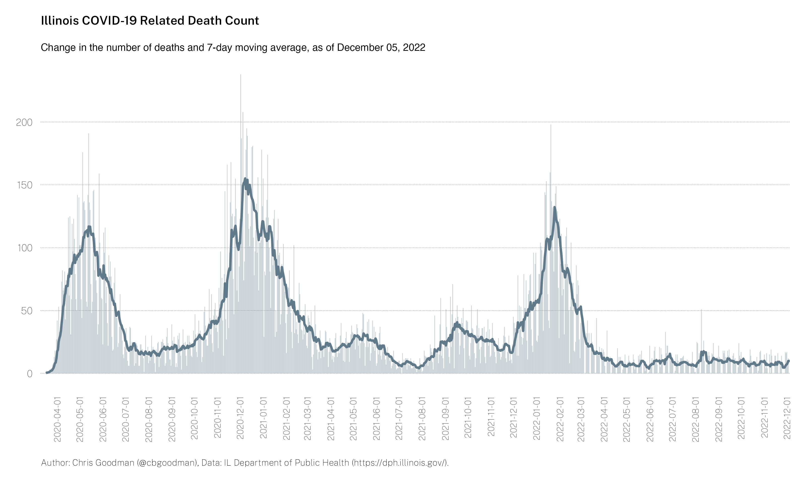
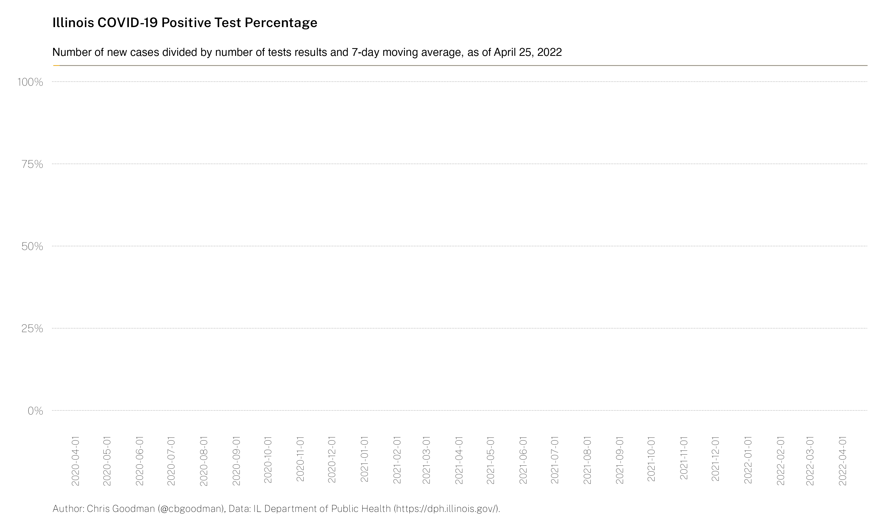

# Illinois COVID-19 Statistics

All data are sourced from the Illinois Department of Public Health [https://dph.illinois.gov/covid19](https://dph.illinois.gov/covid19).

### Daily case count and 7-day moving average

### Daily death count and 7-day moving average

### Daily test count and 7-day moving average

### Daily positive rate and 7-day moving average

## Contents of `/code/`
* `dph-json-state.r` - Master file to create manipulate DPH json, format data
  * `il-covid-cases.r` - Creates two histograms, one of total cases and one of daily cases.
  * `il-covid-deaths.r` - Creates two histograms, one of total deaths and one of daily deaths.
  * `il-testing.r` - Creates two histograms and one line graph, total tests conducted, daily tests conducted, and positive rate over time.

## Contents of `/images/`
* il-covid-cases.png - Cumulative cases
* il-covid-chg-cases.png - Daily cases
* il-covid-deaths.png - Cumulative deaths
* il-covid-chg-deaths.png - Daily deaths
* il-covid-tests.png - Cumulative tests
* il-covid-chg-test.png - Daily tests
* il-covid-positive-rate.png - Daily positive rate
