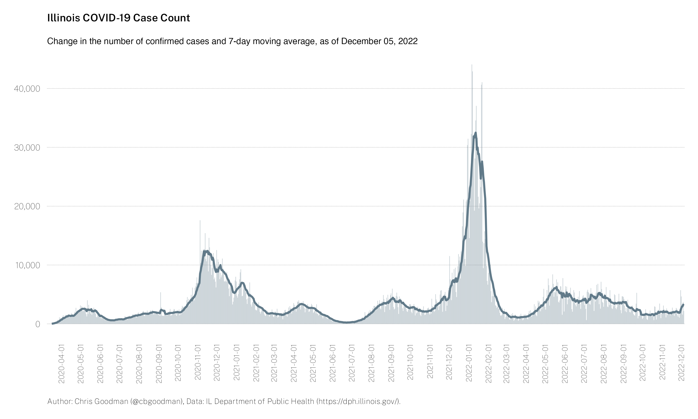
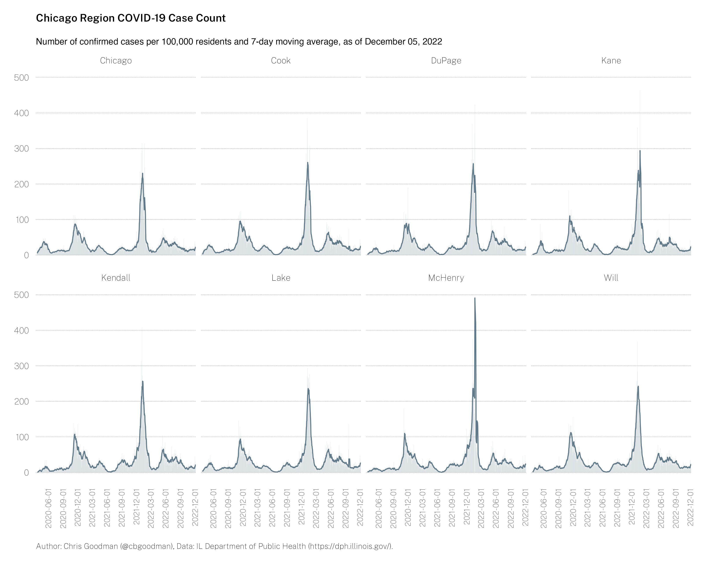

# Illinois COVID-19 Statistics

All data are sourced from the Illinois Department of Public Health [https://dph.illinois.gov/covid19](https://dph.illinois.gov/covid19).

### Daily case count and 7-day moving average

### Daily death count and 7-day moving average

### Daily test count and 7-day moving average

### Daily positive rate and 7-day moving average

### Daily case count and 7-day moving average, Chicago Metro Counties

### Daily case count and 7-day moving average, 4-year public higher education hosting counties

## Data files
There are two files from which all the above visualizations are made. The variable metadata can be found below. The first four or five variables are direct imports from IDPH.

> Note: Throughout the data, there are negative numbers for daily counts. This is an artifact of the reporting by IDPH when the total number of tests/cases/deaths is higher the day before than the current day. I have left them in the data for completeness; however, you may wish to change these negative numbers to zeros.

* `il-covid.csv` - State-level COVID-19 data, plus calculated daily counts
  * `testDate` - Date
  * `total_tested` - Total testing volume on `testDate`
  * `confirmed_cases`	- Total confirmed cases on `testDate`
  * `deaths` - Total deaths attributed to COVID-19 on `testDate`
  * `daily_total_tested` - Daily change in the total number of tests conducted
  * `daily_confirmed_cases`	- Daily change in confirmed cases
  * `daily_deaths` - Daily change in deaths
* `il-covid-county.csv` - County-level COVID-19 data, plus calculated daily counts
  * `testDate` - Date
  * `County` - County
  * `total_tested` - Total testing volume on `testDate`
  * `confirmed_cases`	- Total confirmed cases on `testDate`
  * `deaths` - Total deaths attributed to COVID-19 on `testDate`
  * `population` - 2019 county (or state) population estimates, in 1,000s
  * `daily_total_tested` - Daily change in the total number of tests  conducted
  * `daily_confirmed_cases`	- Daily change in confirmed cases
  * `daily_deaths` - Daily change in deaths

## Contents of `/code/`
* `dph-json-county.r` - Creates county-level dataset and creates Chicago Metro histogram.
* `dph-json-state.r` - Master file to create manipulate DPH json, format data.
  * `il-covid-cases.r` - Creates two histograms, one of total cases and one of daily cases.
  * `il-covid-deaths.r` - Creates two histograms, one of total deaths and one of daily deaths.
  * `il-testing.r` - Creates two histograms and one line graph, total tests conducted, daily tests conducted, and positive rate over time.

## Contents of `/images/`
* chi-covid-chg-cases.png - Chicago Metro per capita case count
* college-covid-chg-cases.png - 4-year college counties per capita case count
* il-covid-cases.png - Cumulative cases
* il-covid-chg-cases.png - Daily cases
* il-covid-deaths.png - Cumulative deaths
* il-covid-chg-deaths.png - Daily deaths
* il-covid-tests.png - Cumulative tests
* il-covid-chg-test.png - Daily tests
* il-covid-positive-rate.png - Daily positive rate
