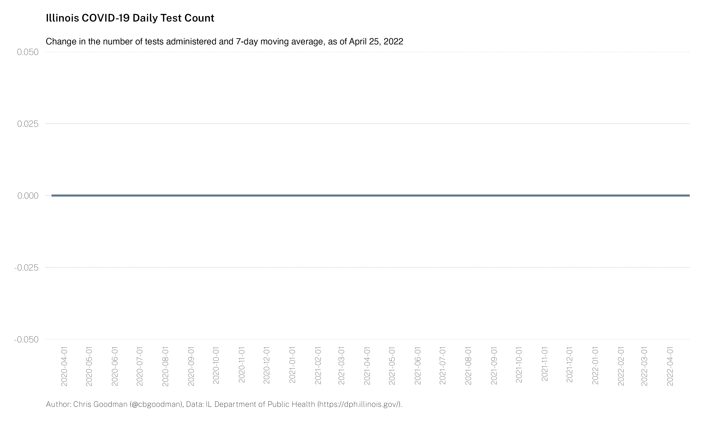
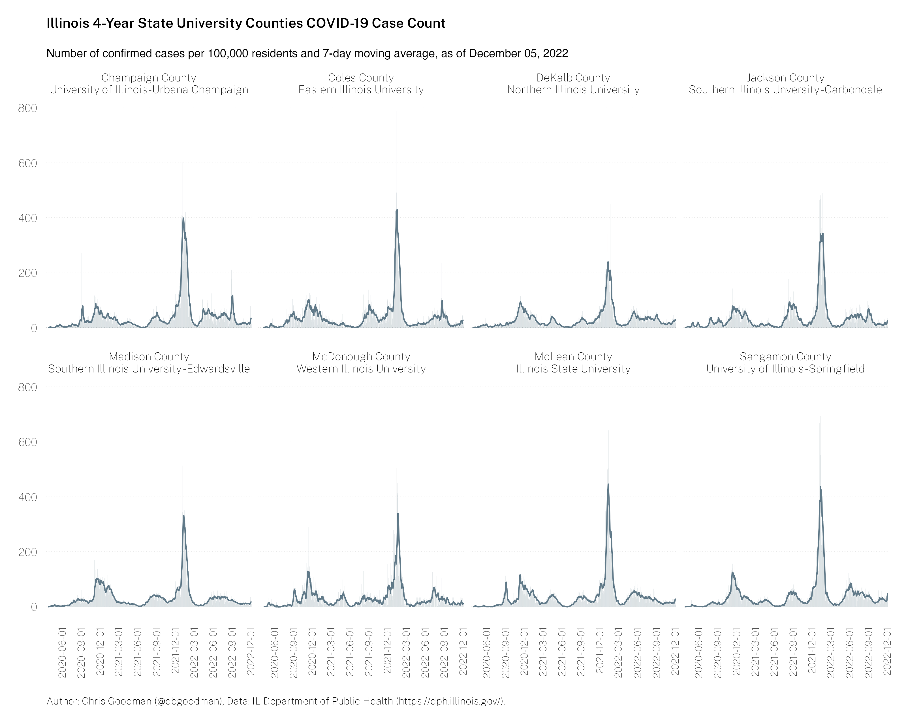
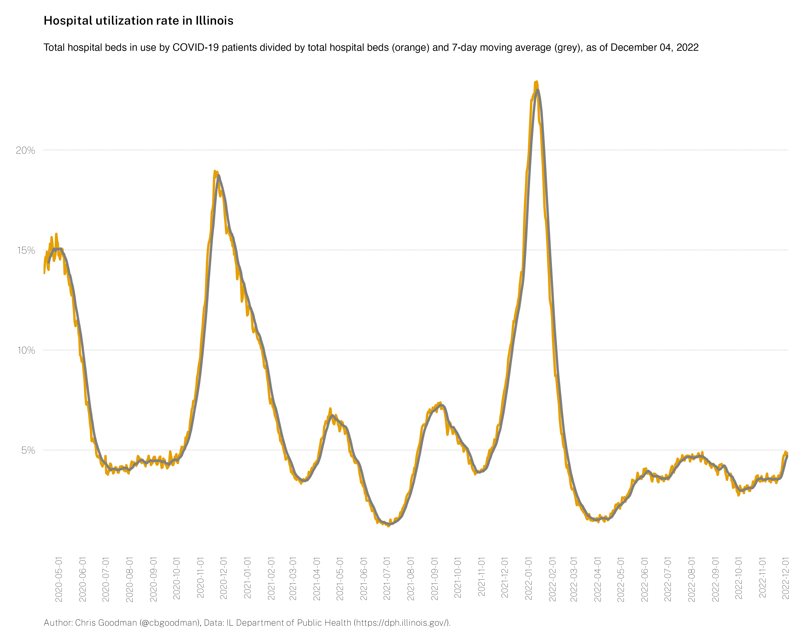
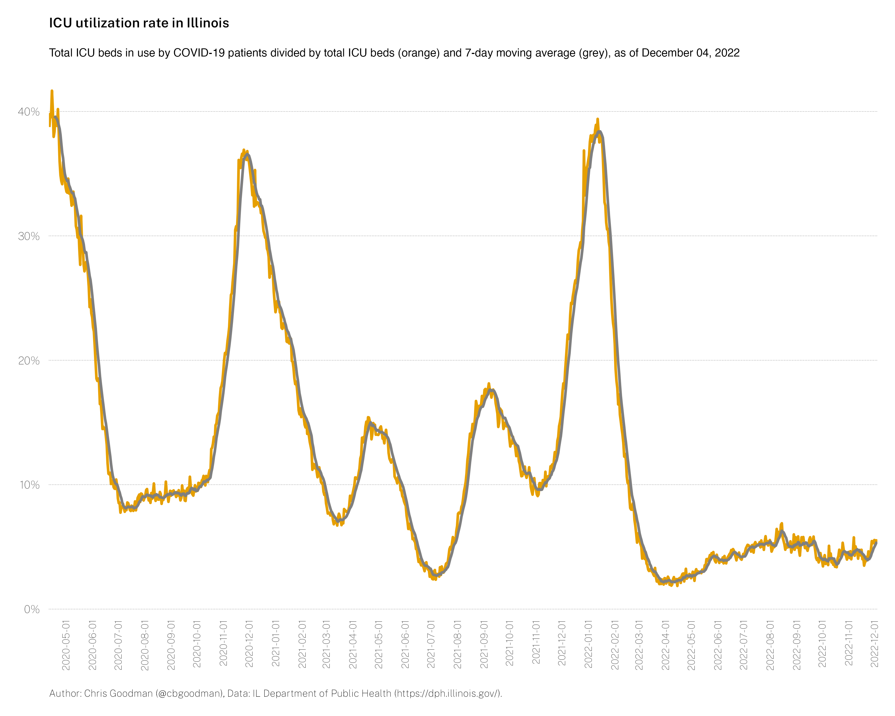
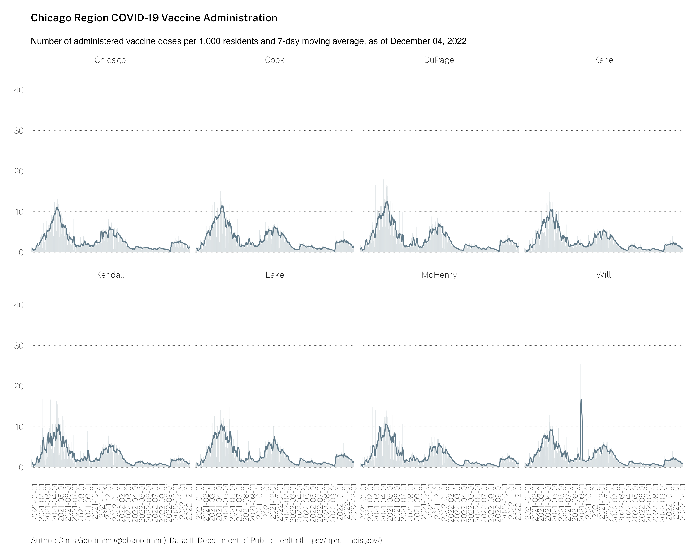

# Illinois COVID-19 Statistics

* Last updated: `2021-06-18`
* Jump to: [`Data files`](#data-files) [`code`](#contents-of-code) [`images`](#images)

---

All data are sourced from the Illinois Department of Public Health [https://dph.illinois.gov/covid19](https://dph.illinois.gov/covid19).

### Daily case count and 7-day moving average

### Daily death count and 7-day moving average

### Daily test count and 7-day moving average

### Daily positive rate and 7-day moving average

### Daily case count and 7-day moving average, Chicago Metro Counties

### Daily case count and 7-day moving average, 4-year public higher education hosting counties

### Hospital bed utilization and 7-day moving average

### Hospital bed utilization rate and 7-day moving average

### ICU bed utilization and 7-day moving average

### ICU bed utilization rate and 7-day moving average

### Daily count of COVID-19 vaccine doses administered

### Daily count of COVID-19 vaccine doses administered and 7-day moving average, Chicago Metro Counties

## Data files
There are two files from which all the above visualizations are made. The variable metadata can be found below. The first four or five variables are direct imports from IDPH.

> Note: Throughout the data, there are negative numbers for daily counts. This is an artifact of the reporting by IDPH when the total number of tests/cases/deaths is higher the day before than the current day. I have left them in the data for completeness; however, you may wish to change these negative numbers to zeros.

* `il-covid.csv` - State-level COVID-19 data, plus calculated daily counts
  * `testDate` - Date
  * `total_tested` - Total testing volume on `testDate`
  * `confirmed_cases`	- Total confirmed cases on `testDate`
  * `deaths` - Total deaths attributed to COVID-19 on `testDate`
  * `daily_total_tested` - Daily change in the total number of tests conducted
  * `daily_confirmed_cases`	- Daily change in confirmed cases
  * `daily_deaths` - Daily change in deaths
* `il-covid-county.csv` - County-level COVID-19 data, plus calculated daily counts
  * `testDate` - Date
  * `County` - County
  * `total_tested` - Total testing volume on `testDate`
  * `confirmed_cases`	- Total confirmed cases on `testDate`
  * `deaths` - Total deaths attributed to COVID-19 on `testDate`
  * `population` - 2019 county (or state) population estimates, in 1,000s
  * `daily_total_tested` - Daily change in the total number of tests  conducted
  * `daily_confirmed_cases`	- Daily change in confirmed cases
  * `daily_deaths` - Daily change in deaths
* `il-covid-vaccine-county` - County-level COVID-19 vaccination data, plus calculated daily counts
  * `Report_Date` - Date
  * `County` - County
  * `AdministeredCount` - Total number of reported vaccine doses administered
  * `AdministeredCountChange` - Number of reported vaccine doses administered on `Report_Date`
  * `AdministedCountRollAvg` - 7-day moving average of `AdministeredCountChange`
  * `PersonsFullyVaccinated` - Number of individuals fully vaccinated (two-dose (Moderna/Pfizer) or one-dose (J&J))
  * `PctVaccinatedPopulation` - Percent of the population `PersonsFullyVaccinated`

## Contents of `/code/`
* `main.r` - The main file that loads packages, downloads data, processes the data, and created all graphics
* `packages.r` - Loads required packages
* `download.r` - downloads data require for visualizations  
  * `download-county.r` - helper file to download county-level data
  * `download-county-vax.r` - helper file to download county-level vaccination data
* `process-data.r` - process downloaded data, exports some data to CSV
* Visualization files
  * `dph-json-region.r` - Creates a regional-level line graph of positive rate over time
  * `dph-json-county.r` - Creates county-level dataset and creates Chicago Metro histogram.
  * `dph-json-county-heatmap.r` - Creates county-level heatmap of cases.
  * `dph-json-hospitalization.r` - Creates two histograms and two line graphs plotting hospital and ICU bed usage and utilization.
  * `il-covid-cases.r` - Creates two histograms, one of total cases and one of daily cases.
  * `il-covid-deaths.r` - Creates two histograms, one of total deaths and one of daily deaths.
  * `il-testing.r` - Creates two histograms and one line graph, total tests conducted, daily tests conducted, and positive rate over  time.
  * `dph-vaccine.r` - Creates a bar chart of daily COVID-19 vaccine doses administered.
  * `dph-vaccine-county.r` - Creates a bar chart of daily COVID-19 vaccine doses administered per capita by county.

## Contents of `/images/`
* chi-covid-chg-cases.png - Chicago Metro per capita case count
) chi-covid-chg-vaccine.png - Chicago Metro per capita vaccine count
* college-covid-chg-cases.png - 4-year college counties per capita case count
* hospital_util_rate.png - Percent usage of hospital beds for COVID-19
* hospitalization.png - Total hospital beds in use for COVID-19
* icu_util_rate.png - Percent usage of ICU beds for COVID-19
* icu.png - Total ICU beds in use for COVID-19
* il-administeredcount.png - COVID-19 vaccine doses administered
* il-covid-cases.png - Cumulative cases
* il-covid-chg-cases.png - Daily cases
* il-covid-deaths.png - Cumulative deaths
* il-covid-chg-deaths.png - Daily deaths
* il-covid-tests.png - Cumulative tests
* il-covid-chg-test.png - Daily tests
* il-covid-positive-rate.png - Daily positive rate
